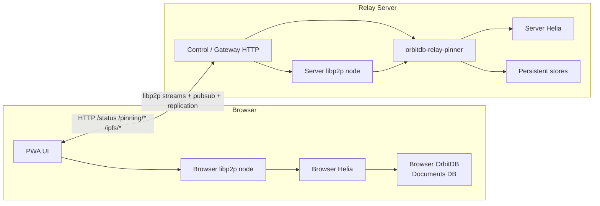
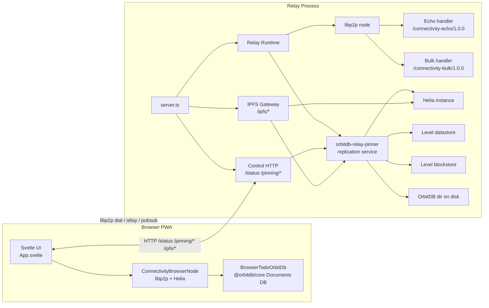
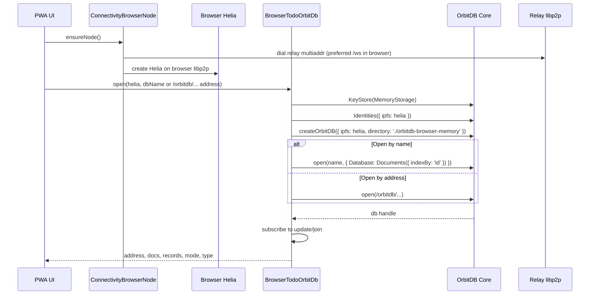
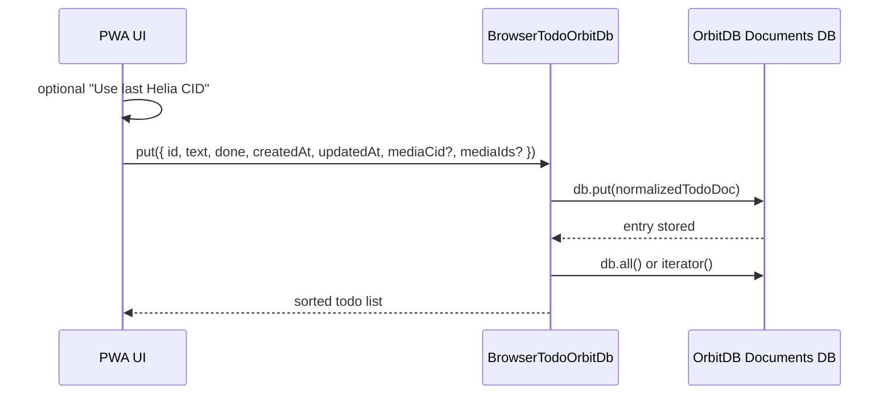
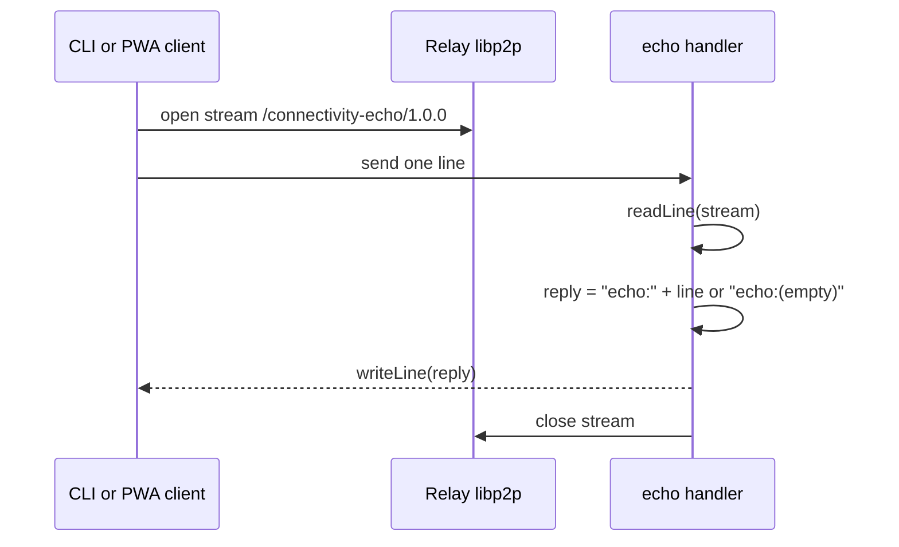
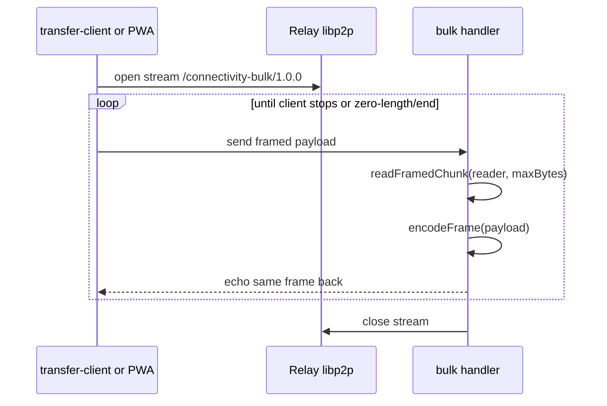
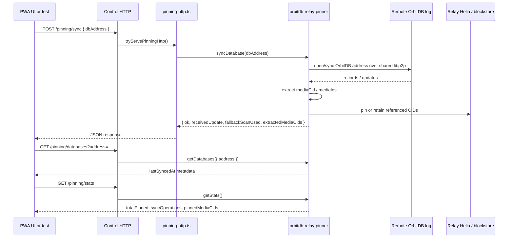
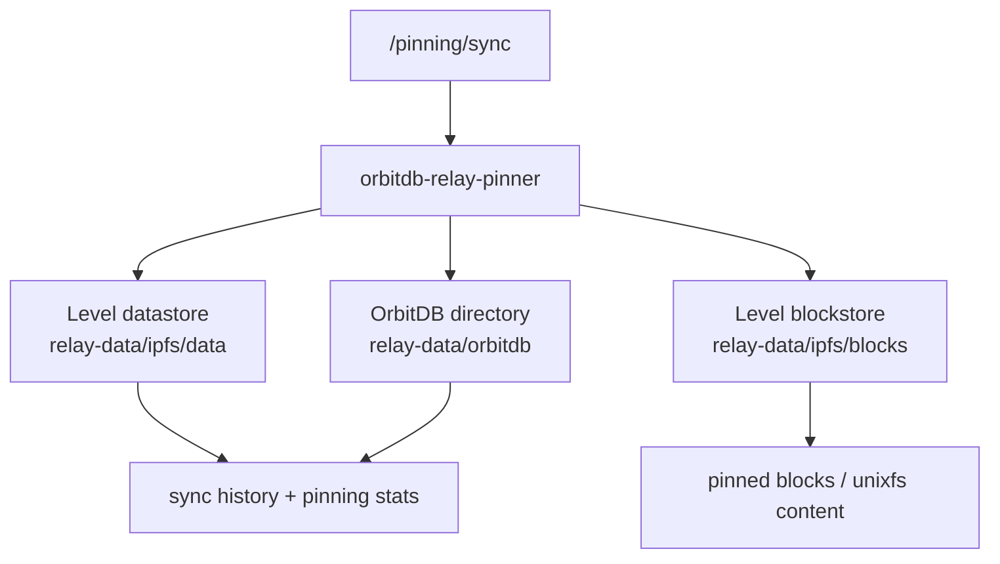
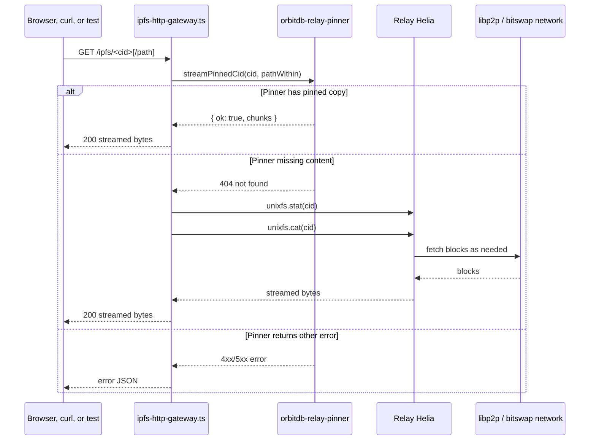

# Architecture

This document maps the current implementation in this repo, centered around the relay runtime in [src/relay-runtime.ts](/Users/nandi/Projects/helia-connectivity-lab/src/relay-runtime.ts:1), the control and gateway HTTP surface in [src/control-http.ts](/Users/nandi/Projects/helia-connectivity-lab/src/control-http.ts:1), [src/ipfs-http-gateway.ts](/Users/nandi/Projects/helia-connectivity-lab/src/ipfs-http-gateway.ts:1), and the browser OrbitDB flow in [apps/pwa/src/lib/browserNode.ts](/Users/nandi/Projects/helia-connectivity-lab/apps/pwa/src/lib/browserNode.ts:1) plus [apps/pwa/src/lib/todoOrbitdb.ts](/Users/nandi/Projects/helia-connectivity-lab/apps/pwa/src/lib/todoOrbitdb.ts:1).

The relay is intentionally a single combined node:

- One `libp2p` process hosts relay transport, custom echo/bulk protocols, gossipsub, peer discovery, and DCUtR.
- The same process mounts `orbitdb-relay-pinner`, which exposes Helia-backed pinning and sync handlers.
- HTTP routes are a thin control and read API in front of that runtime: `/status`, `/pinning/*`, and `/ipfs/*`.

## 0. Browser vs Server

The most important split is:

- Browser:
  The PWA creates its own `libp2p` node, its own Helia instance, and its own OrbitDB instance in memory.
- Server:
  The relay process creates a different `libp2p` node on the VPS, then mounts echo, bulk, Helia-backed retrieval, and OrbitDB pinning on top of that node.
- Connection between them:
  The browser dials the relay over libp2p for peer connectivity and OrbitDB replication, and calls the relay over plain HTTP for `/status`, `/pinning/*`, and `/ipfs/*`.

In other words:

- Echo and bulk are browser/client to relay libp2p stream protocols.
- OrbitDB data is authored in the browser.
- OrbitDB pinning and IPFS retrieval happen on the relay server.
- The relay never reaches into browser memory directly; it only sees what is exposed through libp2p replication and HTTP requests.



## 1. High-Level Integration



## 2. OrbitDB Integration

The browser opens OrbitDB on top of its own Helia/libp2p node. When opened by name, it creates a `Documents({ indexBy: 'id' })` database; when opened by `/orbitdb/...` address, it opens in browse mode.



### Write path for todos



`mediaCid` and `mediaIds` are the bridge from OrbitDB records to relay-side media pinning.

### What stays in the browser vs what moves to the server

- Browser-only:
  `ConnectivityBrowserNode`, browser Helia, and `BrowserTodoOrbitDb` live only in the PWA tab.
- Browser-authored data:
  Todo records are created in the browser and stored in the browser-opened OrbitDB database.
- Server-visible data:
  The server only sees that database after being given its OrbitDB address and syncing it through the relay pinner.
- Server-persisted data:
  Sync history, pinned media CIDs, and retained blocks are stored on the relay filesystem.

## 3. Echo Protocol

The echo protocol is a simple line-based request/response handler attached directly to the relay libp2p node in `attachEchoHandler`.



Implementation anchors:

- Protocol constant: [src/protocol.ts](/Users/nandi/Projects/helia-connectivity-lab/src/protocol.ts:1)
- Handler registration: [src/relay-runtime.ts](/Users/nandi/Projects/helia-connectivity-lab/src/relay-runtime.ts:52)

### Reuse notes

- Easy to reuse:
  The protocol id plus the stream handler pattern are generic libp2p building blocks.
- Not a libp2p service:
  `attachEchoHandler` is just a protocol handler registered with `libp2p.handle(...)`; it is not packaged as a standalone libp2p service.
- Project-specific pieces:
  The exact line format and the `"echo:"` response convention are app logic from this repo.

If another libp2p project wants this behavior, it can copy:

- [src/protocol.ts](/Users/nandi/Projects/helia-connectivity-lab/src/protocol.ts:1)
- [src/stream-line.ts](/Users/nandi/Projects/helia-connectivity-lab/src/stream-line.ts:1)
- the `attachEchoHandler` implementation from [src/relay-runtime.ts](/Users/nandi/Projects/helia-connectivity-lab/src/relay-runtime.ts:52)

## 4. Bulk Protocol

The bulk protocol is a framed binary echo loop for sustained transfer testing. Each message is `[u32be length][payload]`, capped by `BULK_MAX_CHUNK_BYTES`.



This sits entirely on libp2p streams and does not involve Helia or OrbitDB.

### Reuse notes

- Easy to reuse:
  The framed binary protocol loop is generic and can be moved into another libp2p project with very little change.
- Not a libp2p service:
  `attachBulkHandler` is also just a protocol handler registered on a node, not a separately packaged service.
- Project-specific pieces:
  The chosen frame format, chunk limits, and transfer-test semantics are local design choices.

The most reusable pieces are:

- [src/protocol.ts](/Users/nandi/Projects/helia-connectivity-lab/src/protocol.ts:1)
- [src/stream-binary.ts](/Users/nandi/Projects/helia-connectivity-lab/src/stream-binary.ts:1)
- [src/bulk-constants.ts](/Users/nandi/Projects/helia-connectivity-lab/src/bulk-constants.ts:1)
- the `attachBulkHandler` implementation from [src/relay-runtime.ts](/Users/nandi/Projects/helia-connectivity-lab/src/relay-runtime.ts:30)

## 5. OrbitDB Pinning and Sync

This section has three separate layers, and it helps to keep them distinct:

- Imported directly from `orbitdb-relay-pinner`:
  the `orbitdbReplicationService(...)` libp2p service and the pinning handler object returned by `createPinningHttpHandlers()`.
- Implemented in this repo on top:
  the server wiring that mounts that service onto the relay libp2p node in [src/relay-runtime.ts](/Users/nandi/Projects/helia-connectivity-lab/src/relay-runtime.ts:1).
- Implemented in this repo around it:
  the HTTP wrapper in [src/pinning-http.ts](/Users/nandi/Projects/helia-connectivity-lab/src/pinning-http.ts:1), which turns the pinner API into `/pinning/stats`, `/pinning/databases`, and `/pinning/sync`.

### What we import vs what we build here

Imported from the package and used directly:

- `orbitdbReplicationService(...)`
- the `services.orbitdbReplication` libp2p service instance created from it
- `createPinningHttpHandlers()`
- the returned handler methods:
  `getStats()`, `getDatabases()`, `syncDatabase()`, and optionally `streamPinnedCid()`

Built in this repo:

- persistent path setup for datastore, blockstore, and OrbitDB directories
- mounting the imported service into the relay node's `services` object
- exposing the returned pinner methods over HTTP
- request parsing, response JSON, validation, and retry/coalescing logic around `syncDatabase()`

Not implemented here:

- the actual OrbitDB replication logic
- the actual pinning logic
- the internal tracking of synced databases and pinned media

Those behaviors belong to `orbitdb-relay-pinner`; this repo composes and exposes them.

### Exact code boundary

The imported service is mounted here:

```ts
services: {
  ...,
  orbitdbReplication: orbitdbReplicationService({
    datastore: levelDatastore,
    blockstore: levelBlockstore,
    orbitdbDirectory: storage.orbitdb,
  }),
}
```

That happens in [src/relay-runtime.ts](/Users/nandi/Projects/helia-connectivity-lab/src/relay-runtime.ts:108).

Then this repo immediately asks that imported service for HTTP-friendly handlers:

```ts
const pinning = libp2p.services.orbitdbReplication.createPinningHttpHandlers()
```

That happens in [src/relay-runtime.ts](/Users/nandi/Projects/helia-connectivity-lab/src/relay-runtime.ts:125).

From that point on, [src/pinning-http.ts](/Users/nandi/Projects/helia-connectivity-lab/src/pinning-http.ts:1) is our own adapter layer around the imported methods.

### What is direct package behavior vs inferred package behavior

Directly visible from this repo's code:

- the package exposes a libp2p service factory named `orbitdbReplicationService(...)`
- that service exposes `createPinningHttpHandlers()`
- the returned handlers support `getStats`, `getDatabases`, `syncDatabase`, and sometimes `streamPinnedCid`
- the service also exposes `ipfs`, which this repo reuses as the relay Helia instance

Inferred from the returned API names, responses, and tests in this repo:

- `syncDatabase(dbAddress)` causes the relay to replicate or inspect that OrbitDB address
- media references such as `mediaCid` and `mediaIds` are extracted during sync
- sync metadata and pinned media are persisted by the package

Those inferred behaviors are strongly suggested by:

- the `RelayPinningSyncResult` shape in [src/pinning-http.ts](/Users/nandi/Projects/helia-connectivity-lab/src/pinning-http.ts:4)
- the `streamPinnedCid(...)` usage in [src/ipfs-http-gateway.ts](/Users/nandi/Projects/helia-connectivity-lab/src/ipfs-http-gateway.ts:161)
- the end-to-end expectations in [apps/pwa/tests/relay-orbitdb-replication.spec.ts](/Users/nandi/Projects/helia-connectivity-lab/apps/pwa/tests/relay-orbitdb-replication.spec.ts:1)



### Read this diagram as "package behavior in the middle, local glue on the sides"

- Left side:
  `Control HTTP` and `pinning-http.ts` are local code from this repo.
- Middle:
  `orbitdb-relay-pinner` is imported package functionality.
- Right side:
  `Remote OrbitDB log` and `Relay Helia / blockstore` are the resources the package operates on.

### What is persisted on the relay



### Browser/server ownership in this flow

- Browser:
  creates the database, writes todos, and sends the relay the database address to sync.
- Server:
  runs the actual sync, tracks replicated databases, extracts media references, and retains content.

### Reuse notes

- Already a libp2p service:
  `orbitdb-relay-pinner` is the most service-like reusable piece in this repo. It is mounted under `services.orbitdbReplication` when the server libp2p node is created.
- Reusable with some glue:
  Another libp2p project could reuse the pinner service directly if it also provides compatible datastore/blockstore/orbitdb directories.
- Not generic by itself:
  [src/pinning-http.ts](/Users/nandi/Projects/helia-connectivity-lab/src/pinning-http.ts:1) is only an HTTP adapter around the pinner API.
- Project-specific composition:
  The retry behavior, JSON shapes, and route names `/pinning/stats`, `/pinning/databases`, `/pinning/sync` are repo-specific HTTP decisions.
- Best mental model:
  we do not reimplement OrbitDB pinning here; we import the pinning service, mount it into libp2p, and wrap it with our own HTTP interface.

Reusable boundary:

- libp2p service:
  `orbitdbReplication: orbitdbReplicationService(...)` in [src/relay-runtime.ts](/Users/nandi/Projects/helia-connectivity-lab/src/relay-runtime.ts:108)
- HTTP adapter:
  `tryServePinningHttp(...)` in [src/pinning-http.ts](/Users/nandi/Projects/helia-connectivity-lab/src/pinning-http.ts:86)

## 6. IPFS Pinning and Retrieval

`GET /ipfs/<cid>` takes a two-stage approach:

1. Ask the relay pinner for a pinned stream via `streamPinnedCid`.
2. If the pinner has no pinned copy and returns `404`, fall back to `unixfs.cat` on the relay's Helia instance.

That means the gateway can serve both:

- content explicitly retained by the OrbitDB relay pinner, and
- content still available through the wider libp2p/Helia network.



### Browser/server ownership in this flow

- Browser or external client:
  asks for `GET /ipfs/<cid>`.
- Server:
  decides whether to serve the bytes from relay-pinned content or from live Helia `unixfs.cat`.
- Network:
  if the content is not already pinned locally, the relay's Helia may still fetch it from other peers over bitswap.

### Reuse notes

- Reusable core idea:
  "serve CID over HTTP, prefer local pinned copy, otherwise fall back to Helia" is portable to another project.
- Not a libp2p service on its own:
  [src/ipfs-http-gateway.ts](/Users/nandi/Projects/helia-connectivity-lab/src/ipfs-http-gateway.ts:1) is an HTTP gateway layer, not a libp2p service.
- Depends on reusable lower layers:
  It relies on a Helia instance and, optionally, the pinner's `streamPinnedCid(...)` API.
- Project-specific pieces:
  Request parsing, timeout policy, logging, and response shaping are local HTTP concerns.

Reusable boundary:

- generic Helia retrieval logic:
  `tryServeRuntimeUnixfsCat(...)` in [src/ipfs-http-gateway.ts](/Users/nandi/Projects/helia-connectivity-lab/src/ipfs-http-gateway.ts:90)
- project composition logic:
  `tryServeIpfsCat(...)` in [src/ipfs-http-gateway.ts](/Users/nandi/Projects/helia-connectivity-lab/src/ipfs-http-gateway.ts:161)

## 7. Practical Summary

- Echo and bulk are pure libp2p protocols attached directly to the relay node.
- OrbitDB in the browser is built on the browser Helia/libp2p node and stores todo docs with optional CID references.
- Relay-side OrbitDB pinning is delegated to `orbitdb-relay-pinner`, mounted into the same runtime as the relay.
- IPFS retrieval first prefers relay-pinned content, then falls back to Helia `unixfs.cat` over the network.

## 8. Reuse Matrix

This is the shortest way to think about portability into another libp2p project:

| Piece | Browser or Server | Kind | Reuse level | Notes |
|---|---|---|---|---|
| `CONNECTIVITY_ECHO_PROTOCOL` + `attachEchoHandler` | Server, with any client | libp2p protocol handler | High | Smallest reusable unit; not packaged as a service. |
| `CONNECTIVITY_BULK_PROTOCOL` + `attachBulkHandler` | Server, with any client | libp2p protocol handler | High | Generic framed stream echo/load-test pattern. |
| `stream-line.ts` | Both | stream utility | High | Generic helper, not tied to this app. |
| `stream-binary.ts` | Both | stream utility | High | Generic helper for framed binary streams. |
| `orbitdbReplicationService(...)` | Server | libp2p service | High | Most directly reusable service-level component. |
| `pinning-http.ts` | Server | HTTP adapter | Medium | Reusable if another app wants the same HTTP API. |
| `ipfs-http-gateway.ts` | Server | HTTP adapter/gateway | Medium | Reusable with Helia, but shaped around this relay runtime. |
| `BrowserTodoOrbitDb` | Browser | OrbitDB UI/storage wrapper | Medium | Good reference for browser OrbitDB usage; app-specific todo schema. |
| `ConnectivityBrowserNode` | Browser | app runtime wrapper | Medium | Useful as a starting point for browser libp2p + Helia + relay dial logic. |
| `server.ts` + `control-http.ts` + `relay-runtime.ts` composition | Server | application composition | Low to Medium | Best reused as a pattern rather than copied unchanged. |
